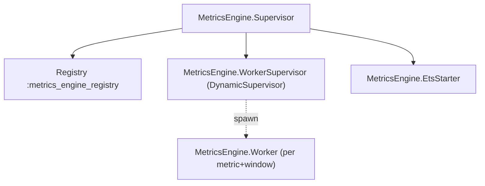

# ARCHITECTURE

## Overview

- One GenServer worker per `{metric_name, window}`.
- Global `Registry` for process discovery.
- `DynamicSupervisor` spawns workers on-demand.
- Shared public ETS table `:metrics_engine_aggregates` for fast reads.

## Data Flow

1. `MetricsEngine.record_metric/1` normalizes the event and routes it to each window's worker.
2. The worker maintains per-tag-combination rolling windows (queues) and aggregates.
3. On each insert, it prunes expired entries and writes current aggregates to ETS:
   key: `{metric, window, tag_key}` → value: `%{count, sum, avg, min, max}`.
4. `MetricsEngine.get_aggregations/2/3` reads ETS and (optionally) folds across a tag filter.

## Supervision Tree

## Rolling Windows
- Windows from config: 60s, 300s, 900s.
- Each group keeps a queue of `{timestamp, value}` plus running `sum, count, min, max`.
- On prune, if expired element equals `min` or `max`, recompute that bound by scanning the queue.

## Concurrency
- Ingestion uses `GenServer.cast/2` (async) to workers; calls are CPU-bound only on the worker.
- Reads hit ETS directly, avoiding worker bottlenecks.

## Trade-offs
- Simplicity over perfect O(1) min/max removal; recomputation is rare and bounded by window size.
- ETS is the single shared structure; updates are per-worker, reducing contention.

## Scaling
- Multiple nodes can share ETS per node; extend via distributed registry and consistent hashing if needed.
